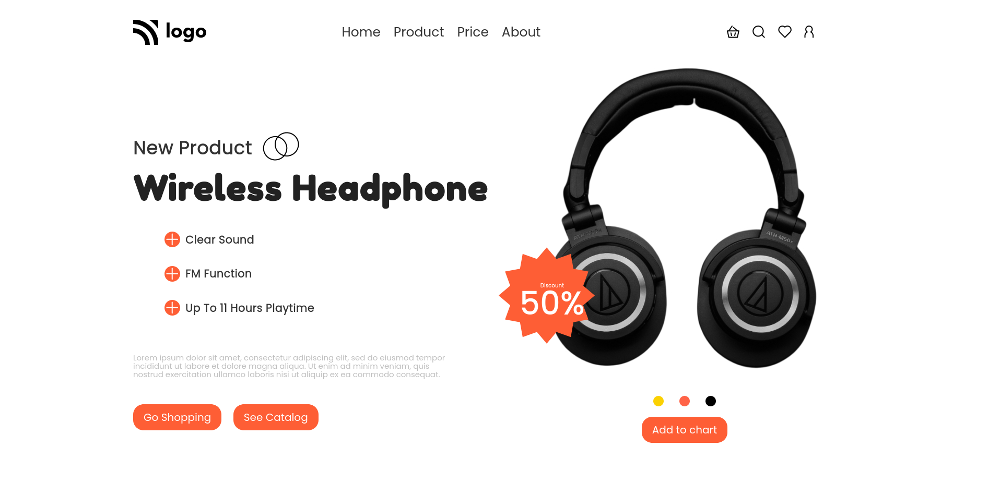

# PROJECT 7 - Product Home Page

This is the seventh project among the 15 Ineuron-projects.

## Table of contents

- [Overview](#overview)
  - [Screenshot](#screenshot)
  - [Links](#links)
- [My process](#my-process)
  - [Built with](#built-with)
  - [Time required](#time-required)
  - [What I learned](#continues-development)
  - [Useful resources](#useful-resources)
- [Author](#author)
- [Acknowledgments](#acknowledgments)

## Overview

### Screenshot



### Links

- Code File URL: [github.com](https://github.com/Jyotimoykathar/Project-02)
- Live Site URL: [netlify.app](https://project-02-restaurant.netlify.app/)

## My process

### Built with

- Semantic HTML5 markup
- CSS custom properties
- Flexbox Css

### Time required

Nearly three day required to get the desired position of the image.

### What I learned

This is the css design code snippet of the attribute selections that i learned through this project.

```css
[alt="logo"] {
  width: 12rem;
}
[alt="actions"] {
  display: none;
}
[name="menu-outline"] {
  display: block;
  font-size: 5rem;
  cursor: pointer;
}
.nav-items {
  display: none;
}
[alt="circles"] {
  width: 80%;
}
```

### Continued development

I still have a lot to learn about image positioning and with media breakpoints.

### Useful resources

- [MDN](https://developer.mozilla.org/en-US/) - This website helped me to any thing i had to look upon.

## Author

- Github page- [Jyotimoykathar](https://github.com/Jyotimoykathar/)

## Acknowledgments

Special Thanks to Ineuron team for the projectto test and improve my CSS skills.
